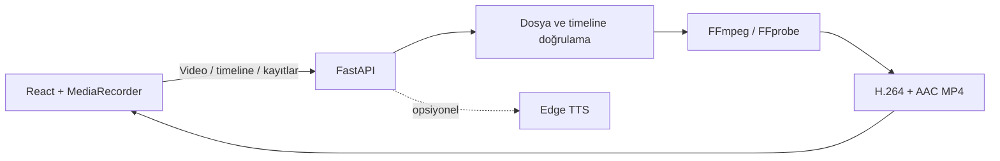

# DublajLab — Kendi Sesinle Dublaj Studio

[](https://github.com/berat1834/dublajlab/actions/workflows/ci.yml)
[](LICENSE)
[](https://www.python.org/)
[](https://react.dev/)

Kısa videonu izle, zamanlanmış replikleri kendi mikrofonunla kaydet, altyazılı ve dublajlı MP4’ünü indir.

DublajLab, Türkçe kullanıcılar için hazırlanmış portföy ve demo odaklı bir yaratıcı medya aracıdır. Ana deneyim **kullanıcının kendi sesiyle dublaj** yapmasıdır. İlk sürümdeki metinden sese üretim kaldırılmamış, arayüzde ikincil **AI ses** modu olarak korunmuştur.

> Durum: Test edilebilir MVP. Production hardening çalışmaları küçük sprintlerle devam etmektedir.

## Hızlı bağlantılar

- [Kurulum](#backend-kurulumu)
- [Mimari](#mimari)
- [API endpointleri](#api-endpointleri)
- [Test ve kalite kontrolleri](#test-ve-kalite-kontrolleri)
- [Manuel smoke test](scripts/smoke_test.md)
- [Teknik not](docs/TEKNIK_NOT.md)
- [Roadmap](#roadmap)

## Demo amacı

Bu MVP tarayıcı ve medya backend’i arasında uçtan uca bir prodüksiyon akışı gösterir:

1. Kullanıcı en fazla 60 saniyelik kendi videosunu yükler.
2. Uygulama video süresine göre düzenlenebilir replik satırları hazırlar.
3. Kullanıcı her repliği ilgili sahneyi izlerken mikrofonuyla kaydeder.
4. Kayıtlar dinlenebilir veya yeniden alınabilir.
5. Backend kayıtları JSON zaman çizelgesindeki başlangıç/bitiş noktalarına yerleştirir.
6. FFmpeg orijinal sesi kapatır ya da %20 seviyesine kısar; altyazı ve watermark’ı gömer.
7. Sonuç H.264/AAC MP4 olarak önizlenir ve indirilir.

Repo telifli bir demo video barındırmaz; MVP kaynak adımında kullanıcının kendi videosunu yüklemesini destekler.

## Ekran görüntüsü ve demo GIF

> Görsel placeholder: Profesyonel iki kolonlu editörün masaüstü ekran görüntüsü ve mobil kayıt akışını gösteren kısa bir GIF, gerçek ürün demosu tamamlandığında bu bölüme eklenecektir.

Görseller eklenirken yalnızca proje sahibinin kendi videosu veya açık lisanslı/telifsiz bir kaynak kullanılmalıdır. Telifli film, dizi ya da sosyal medya klibi repoya eklenmemelidir. Önerilen dosya konumları `docs/assets/dublajlab-editor.webp` ve `docs/assets/dublajlab-mobile.gif` şeklindedir.

## Özellikler

### Ana mod — Kendi sesim

- `.mp4`, `.mov` ve `.webm` yükleme
- 50 MB dosya ve 60 saniye süre sınırı
- FFprobe ile boş/bozuk dosya ve süre kontrolü
- `id`, `start`, `end`, `text` alanlarından oluşan replik timeline’ı
- Replik metnini ve zaman aralığını düzenleme, yeni replik ekleme/silme
- Sahneyi başlangıç noktasından oynatma
- Tarayıcı `MediaRecorder` API’si ile kayıt başlatma/durdurma
- Otomatik slot süresi sonunda kayıt durdurma
- Kaydı tarayıcıda dinleme ve yeniden alma
- Her kaydı ilgili zaman aralığına yerleştiren FFmpeg filter graph
- Orijinal sesi tamamen kapatma veya düşük seviyede miksleme
- Zamanlanmış ASS altyazı ve DublajLab watermark’ı
- H.264 + AAC, `yuv420p`, fast-start MP4 export
- Sonuç önizleme ve indirme

### Opsiyonel mod — AI ses

- En fazla 500 karakterlik metin girişi
- Spiker, Robot, Dramatik, Belgesel ve Enerjik hazır stilleri
- Edge TTS ile Türkçe yapay ses üretimi
- Gerçek kişi ya da ünlü sesi taklidi yoktur

## Etik, gizlilik ve telif

> Bu uygulama eğlence, parodi ve portföy amaçlıdır. Gerçek kişileri taklit etmek, yanıltıcı içerik üretmek veya telifli içerikleri izinsiz dağıtmak kullanıcının sorumluluğundadır.

- Yalnızca kullanma hakkına sahip olduğunuz videoları yükleyin.
- Ünlü/gerçek kişi ses klonlama, deepfake ve sosyal medya bağlantısından video indirme desteklenmez.
- Mikrofon kayıtları frontend’de blob olarak tutulur, export sırasında backend’e gönderilir ve FFmpeg işlemi bittiğinde geçici sunucu kopyaları silinir.
- Kalıcı çıktılar ve kaynak videolar MVP’de `backend/data` altında tutulur; süre bazlı temizlik roadmap kapsamındadır.

## Teknoloji yığını

| Katman | Teknoloji |
| --- | --- |
| Backend | Python 3.11+, FastAPI, Pydantic, Uvicorn |
| Kayıt | MediaRecorder / getUserMedia |
| Medya | FFmpeg, FFprobe, ASS, H.264, AAC |
| Opsiyonel TTS | Edge TTS, değiştirilebilir servis katmanı |
| Frontend | React 18, TypeScript, Vite, Tailwind CSS |
| Test | Pytest, FastAPI TestClient, ESLint, TypeScript |

## Mimari



Backend router'ları HTTP sözleşmesini, servisler ise dosya saklama, TTS, altyazı, FFmpeg ve temizlik sorumluluklarını taşır. FFmpeg komutları shell string'i yerine argüman listesiyle çalıştırılır. Ayrıntılar [teknik mimari notunda](docs/TEKNIK_NOT.md) bulunur.

## Proje yapısı

```text
.
├── backend/
│   ├── main.py
│   ├── config.py
│   ├── models.py
│   ├── routers/video.py
│   ├── routers/maintenance.py
│   ├── services/
│   │   ├── ffmpeg_service.py
│   │   ├── file_storage.py
│   │   ├── subtitle_service.py
│   │   ├── cleanup_service.py
│   │   └── tts_service.py
│   └── tests/test_video_api.py
├── frontend/
│   ├── src/
│   │   ├── components/TimelineRecorder.tsx
│   │   ├── components/UploadZone.tsx
│   │   ├── lib/api.ts
│   │   └── App.tsx
│   └── package.json
└── README.md
```

## Gereksinimler

- Python 3.11 veya üzeri
- Node.js 20 veya üzeri
- FFmpeg ve FFprobe
- Mikrofon erişimi olan güncel Chrome, Edge veya Safari
- AI ses modu kullanılacaksa internet bağlantısı

Mikrofon erişimi tarayıcılarda güvenli bağlam gerektirir. Yerel geliştirmede `http://localhost:5173` güvenli kabul edilir; uzak ortamda HTTPS kullanın.

## FFmpeg kurulumu

### Windows — Winget (önerilen)

PowerShell'i normal kullanıcı olarak açın:

```powershell
winget install --id Gyan.FFmpeg --exact
```

Kurulum bittikten sonra **PowerShell'i kapatıp yeniden açın**. Açık terminal, güncellenen PATH değerini görmeyebilir.

### Windows — Chocolatey alternatifi

Chocolatey kuruluysa yönetici PowerShell'de:

```powershell
choco install ffmpeg -y
```

Ardından terminali yeniden açın.

### Windows — PATH kontrolü

Yeni PowerShell penceresinde çalıştırın:

```powershell
Get-Command ffmpeg
Get-Command ffprobe
where.exe ffmpeg
where.exe ffprobe
ffmpeg -version
ffprobe -version
```

İlk dört komut çalıştırılabilir dosyaların yolunu, son iki komut sürümü göstermelidir. `ffmpeg-*.tar.xz` dosyası kaynak kod arşividir; tek başına Windows çalıştırıcısı değildir. PATH kullanmak istemiyorsanız `FFMPEG_BINARY` ve `FFPROBE_BINARY` değişkenlerine `.exe` dosyalarının tam yollarını verin.

Diğer işletim sistemleri:

- macOS: `brew install ffmpeg`
- Ubuntu/Debian: `sudo apt install ffmpeg`

Kurulumdan sonra doğrulayın:

```powershell
ffmpeg -version
ffprobe -version
```

Araçlar PATH’te değilse `FFMPEG_BINARY` ve `FFPROBE_BINARY` ortam değişkenlerine tam yollarını verin.

## Backend kurulumu

Proje kökünde:

```powershell
python -m venv .venv
.\.venv\Scripts\Activate.ps1
python -m pip install -r backend/requirements-dev.txt
uvicorn backend.main:app --reload --port 8000
```

macOS/Linux aktivasyonu:

```bash
source .venv/bin/activate
```

Swagger dokümantasyonu: `http://localhost:8000/docs`

## Frontend kurulumu

Yeni bir terminalde:

```powershell
cd frontend
npm install
npm run dev
```

Arayüz: `http://localhost:5173`

## Ortam değişkenleri

| Değişken | Varsayılan | Açıklama |
| --- | --- | --- |
| `ALLOWED_ORIGINS` | `http://localhost:5173` | Virgülle ayrılmış CORS origin listesi |
| `APP_ENV` | `development` | `development`, `local`, `test` veya production ortam adı |
| `MAINTENANCE_TOKEN` | boş | Production cleanup endpoint erişim anahtarı |
| `FFMPEG_BINARY` | `ffmpeg` | FFmpeg komutu veya tam yolu |
| `FFPROBE_BINARY` | `ffprobe` | FFprobe komutu veya tam yolu |
| `MEDIA_ROOT` | `backend/data` | Kaynak, çıktı, metadata ve geçici kayıt klasörü |
| `VITE_API_BASE_URL` | `http://localhost:8000` | Frontend’in çağıracağı API adresi |

Örnek dosyalar: `backend/.env.example` ve `frontend/.env.example`. Backend önce süreç ortamını korur, eksik değerleri `backend/.env` ve proje kökündeki `.env` dosyalarından okuyabilir. Gerçek token ve anahtarları Git'e eklemeyin.

## Timeline JSON yapısı

Her mikrofon kaydı aynı `id` değerine sahip replikle eşleştirilir:

```json
[
  {
    "id": "line-1",
    "start": 0.5,
    "end": 2.8,
    "text": "Bu plan gerçekten işe yarayacak mı?"
  },
  {
    "id": "line-2",
    "start": 3.1,
    "end": 5.6,
    "text": "Tabii ki, prod'a cuma günü çıkıyoruz!"
  }
]
```

Kurallar:

- En az 1, en fazla 20 replik
- `id` değerleri benzersiz olmalı ve yalnızca harf, rakam, `_`, `-` içermeli
- `start >= 0`, `end > start` olmalı
- `end` video süresini aşmamalı
- Her replik için aynı sırada bir ses dosyası gönderilmeli
- Her kayıt en fazla 10 MB olabilir

## API endpointleri

| Metot | Endpoint | Açıklama |
| --- | --- | --- |
| `GET` | `/api/health` | Servis sağlık bilgisi |
| `GET` | `/api/system/ffmpeg` | FFmpeg/FFprobe kullanılabilirlik ve sürüm bilgisi |
| `POST` | `/api/video/upload` | `file` alanıyla video yükler ve doğrular |
| `POST` | `/api/video/process-recordings` | Timeline + mikrofon kayıtlarından video üretir |
| `POST` | `/api/video/process` | Opsiyonel AI TTS moduyla video üretir |
| `GET` | `/api/video/preview/{video_id}` | Kaynak videoyu tarayıcıya aktarır |
| `GET` | `/api/video/download/{output_video_id}` | İşlenmiş MP4’ü indirir |
| `POST` | `/api/maintenance/cleanup?older_than_hours=24` | Eski runtime dosyalarını manuel temizler |

Temizlik endpoint'i yalnızca bilinen `uploads`, `outputs`, `tmp`, `audio`, `subtitles`, `recordings` ve `metadata` klasörlerindeki eşikten eski dosyaları siler. En düşük eşik 1 saattir.

- `MAINTENANCE_TOKEN` tanımlıysa her ortamda `X-Maintenance-Token` header'ı zorunludur.
- Token yoksa endpoint yalnızca `development`, `dev`, `local` ve `test` ortamlarında çalışır.
- Production ortamında token tanımlanmamışsa endpoint güvenli biçimde `503` döndürür.

Production örneği:

```powershell
$env:APP_ENV = "production"
$env:MAINTENANCE_TOKEN = "uzun-rastgele-bir-token"
Invoke-RestMethod -Method Post `
  -Uri "http://localhost:8000/api/maintenance/cleanup?older_than_hours=24" `
  -Headers @{ "X-Maintenance-Token" = $env:MAINTENANCE_TOKEN }
```

Kaynak video ve çıktılar kalıcı depolama garantisi olmadan tutulur. Production ortamında bu endpoint'in zamanlanmış görev/cron tarafından düzenli çağrılması önerilir. Geçici ses, kayıt ve altyazı dosyaları başarılı ya da başarısız process sonunda ayrıca silinir.

FFprobe çağrıları 30 saniye, FFmpeg export işlemleri 180 saniye ile sınırlıdır. Süre aşılırsa API kullanıcıya Türkçe hata döndürür ve sunucu çalışmaya devam eder.

`process-recordings` isteği `multipart/form-data` kullanır:

- `video_id`: yükleme sonucundaki UUID
- `timeline`: JSON string
- `recording_ids`: kayıtların sırasını belirten JSON string listesi
- `recordings`: tekrarlanan ses dosyası alanları
- `mute_original_audio`: `true` / `false`
- `burn_subtitles`: `true` / `false`

## Kullanım akışı

1. Backend ve frontend geliştirme sunucularını başlatın.
2. MP4, MOV veya WEBM formatında, en fazla 60 saniyelik videonuzu yükleyin.
3. Oluşturulan repliklerin metin ve zamanlarını düzenleyin.
4. Her satırda **Kaydı başlat** düğmesine basın; tarayıcı mikrofon iznini onaylayın.
5. Kaydı dinleyin, gerekirse **Yeniden kaydet** ile değiştirin.
6. Orijinal sesi kapatma ve altyazı seçeneklerini belirleyin.
7. **Kendi Sesimle Videoyu Oluştur** düğmesine basın.
8. Sonucu izleyin ve MP4 olarak indirin.

AI modu için üstteki **AI ses** sekmesine geçip metin ve hazır stili seçin.

## Test ve kalite kontrolleri

```powershell
# Proje kökünde backend testleri
.\.venv\Scripts\python.exe -m pytest backend/tests -q

# Frontend
cd frontend
npm run lint
npm run build
```

Testler health, FFmpeg bulunabilirliği, video formatı, metin/stil validasyonu, timeline sınırları, multipart kayıt işleme, dosya temizliği ve FFmpeg kayıt geciktirme/miks komutunu kapsar. FFmpeg mevcutsa gerçek entegrasyon testi sentetik bir MP4 ile iki WebM/Opus kaydı üretir, altyazı gömer ve çıktıyı FFprobe ile doğrular; araçlar yoksa bu test atlanır. Mock testler komut ve uygulama kontrol akışını doğrular, gerçek test ise codec/filter binary'lerinin gerçekten çalıştığını kanıtlar.

Ayrıntılı manuel kontrol için [uçtan uca smoke-test rehberine](scripts/smoke_test.md) bakın. Telifsiz yerel test videosu kuralları ve örnek timeline için [demo klasörü açıklamasını](demo/README.md) kullanın.

## Sürekli entegrasyon

GitHub Actions, `main`, `dev` ve `Berat` branch'lerine yapılan push'larda ve `main`/`dev` pull request'lerinde iki bağımsız job çalıştırır:

- Backend: Python 3.12, FFmpeg kurulumu ve tüm Pytest paketi
- Frontend: Node.js 22, `npm ci`, ESLint, production build ve yüksek önem seviyeli audit

Workflow: [`.github/workflows/ci.yml`](.github/workflows/ci.yml)

## Lisans

Proje [MIT Lisansı](LICENSE) ile sunulur. Yüklenen veya demo amacıyla kullanılan üçüncü taraf medya dosyalarının lisansı ayrıca kontrol edilmelidir.

## Roadmap

Yalnızca DublajLab MVP uygulanmıştır. Diğer ürünler bu repoda kodlanmamıştır.

### Faz 1 — DublajLab MVP

- [x] Video upload ve preview
- [x] Replik/timeline editörü
- [x] Replik bazlı mikrofon kaydı, dinleme ve yeniden kayıt
- [x] Kayıtları zaman aralıklarına yerleştirme
- [x] Orijinal sesi kısma/kapatma
- [x] Altyazı ve watermark burn-in
- [x] MP4 preview ve download
- [x] Opsiyonel AI ses modu

### Faz 2 — Profesyonel Kullanıcı Deneyimi

- [x] Masaüstünde iki kolon, mobilde tek kolon ürün akışı
- [x] Açıklayıcı empty/loading/error/success durumları
- [x] Belirgin aktif kayıt ve replik tamamlanma durumları
- [x] Export engel nedeni ve hata sonrası tekrar deneme
- [x] Güçlendirilmiş sonuç önizleme ve yeniden başlama aksiyonları
- [x] Ekran görüntüsü/GIF alanı ve telifsiz medya notu

### Sonraki teknik geliştirmeler

- [ ] Dalga formu ve sürüklenebilir timeline
- [ ] Hazır, açık lisanslı demo video paketi
- [ ] Kayıt ses seviyesi ve gürültü azaltma kontrolleri
- [ ] Video trim ve dikey/yatay export presetleri
- [ ] Arka plan job queue ve otomatik dosya temizliği

### Faz 3 — Müzik Pratik + Cover Studio

- [ ] Audio upload
- [ ] Tempo ve pitch değiştirme
- [ ] Vokal azaltma / instrumental denemesi
- [ ] Karaoke/cover export

Gelecekteki ürün özeti: “Şarkı dosyanı yükle; tempo/ton değiştir, vokal azalt, karaoke/pratik çıktısı al.”

### Faz 4 — Kısa Video Altyazı + Dublaj

- [ ] Speech-to-text
- [ ] Otomatik Türkçe altyazı
- [ ] Kısa AI dublaj
- [ ] Creator export presetleri

## LinkedIn / CV açıklaması

> Built a browser-based Turkish dubbing studio using FastAPI, React, TypeScript and FFmpeg. Implemented timeline-based microphone recording, per-line audio placement, subtitle burn-in, original-audio mixing and H.264 MP4 export, with an optional AI text-to-speech mode.

Önceki proje serisi için istenen CV maddesi de referans amacıyla korunmuştur:

> Built an AI-powered Turkish meme dubbing studio using FastAPI, React/Next.js, FFmpeg and text-to-speech APIs. Implemented video upload, Turkish voiceover generation, subtitle burn-in and MP4 export.

## Bilinen sınırlar

- MVP işlemleri senkrondur; yoğun kullanım için job queue yoktur.
- Kaynak ve çıktı videoları otomatik temizlenmez; manuel cleanup endpoint'i cron/zamanlanmış görevle çağrılmalıdır.
- Mikrofon formatı tarayıcıya göre WebM/Opus veya MP4/AAC olabilir; FFmpeg’in ilgili decoder ile derlenmiş olması gerekir.
- Bu geliştirme ortamında FFmpeg kurulu değilse gerçek medya smoke testi yapılamaz.
- Replik zamanları form alanlarıyla düzenlenir; görsel sürükle-bırak timeline henüz yoktur.
