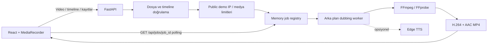

# DublajLab — Kendi Sesinle Dublaj Studio

[](https://github.com/berat1834/dublajlab/actions/workflows/ci.yml)
[](LICENSE)
[](https://www.python.org/)
[](https://react.dev/)

Kısa videonu izle, zamanlanmış replikleri kendi mikrofonunla kaydet, altyazılı ve dublajlı MP4’ünü indir.

DublajLab, Türkçe kullanıcılar için hazırlanmış portföy ve demo odaklı bir yaratıcı medya aracıdır. Ana deneyim **kullanıcının kendi sesiyle dublaj** yapmasıdır. İlk sürümdeki metinden sese üretim kaldırılmamış, arayüzde ikincil **AI ses** modu olarak korunmuştur.

> Durum: Test edilebilir MVP. Production hardening çalışmaları küçük sprintlerle devam etmektedir.

## Hızlı bağlantılar

- [Kurulum](#backend-kurulumu)
- [Docker ile çalıştırma](#docker-ile-local-production-kurulumu)
- [Deployment planı](#deployment-planı)
- [Public demo güvenliği](#public-demo-güvenliği)
- [Mimari](#mimari)
- [API endpointleri](#api-endpointleri)
- [Test ve kalite kontrolleri](#test-ve-kalite-kontrolleri)
- [Manuel smoke test](scripts/smoke_test.md)
- [Demo ve portföy rehberi](docs/DEMO_GUIDE.md)
- [Teknik not](docs/TEKNIK_NOT.md)
- [Roadmap](#roadmap)

## Demo amacı

Bu MVP tarayıcı ve medya backend’i arasında uçtan uca bir prodüksiyon akışı gösterir:

1. Kullanıcı en fazla 60 saniyelik kendi videosunu yükler.
2. Uygulama video süresine göre düzenlenebilir replik satırları hazırlar.
3. Kullanıcı her repliği ilgili sahneyi izlerken mikrofonuyla kaydeder.
4. Kayıtlar dinlenebilir veya yeniden alınabilir.
5. Backend kayıtları JSON zaman çizelgesindeki başlangıç/bitiş noktalarına yerleştirir.
6. FFmpeg orijinal sesi kapatır ya da %20 seviyesine kısar; altyazı ve watermark’ı gömer.
7. Sonuç H.264/AAC MP4 olarak önizlenir ve indirilir.

Repo telifli bir demo video barındırmaz; MVP kaynak adımında kullanıcının kendi videosunu yüklemesini destekler.

## Live Demo / Screenshots / Demo GIF

**Live demo:** Henüz herkese açık bir deployment bulunmuyor. Yerel demo için [kurulum](#backend-kurulumu) ve [demo rehberi](docs/DEMO_GUIDE.md) kullanılabilir.

### Screenshots

GitHub, LinkedIn ve CV sunumunda kullanılacak beş temel ekran için sabit placeholder yolları hazırdır. Gerçek dosyalar henüz repoya eklenmediği için bağlantılar bozuk görsel oluşturmaması amacıyla aşağıda yorum içinde tutulur.

| Ekran | Portföyde göstereceği değer | Placeholder yolu | Durum |
| --- | --- | --- | --- |
| Landing / hero | Ürün vaadi, üç adım, CTA ve çıktı mock'u | `docs/assets/dublajlab-landing-hero.webp` | Çekim bekliyor |
| Template gallery | CSS placeholder kartlar, kategori, süre, replik ve zorluk bilgileri | `docs/assets/dublajlab-template-gallery.webp` | Çekim bekliyor |
| Recording timeline | Zamanlanmış replikler, mikrofon kaydı ve kayıt ilerlemesi | `docs/assets/dublajlab-recording-timeline.webp` | Çekim bekliyor |
| Export result | Sonuç video önizlemesi, MP4 indirme ve yeniden deneme aksiyonları | `docs/assets/dublajlab-export-result.webp` | Çekim bekliyor |
| Mobile view | Tek kolon hero, kaynak seçimi ve kayıt paneli | `docs/assets/dublajlab-mobile.webp` | Çekim bekliyor |

```markdown
<!--  -->
<!--  -->
<!--  -->
<!--  -->
<!--  -->
```

### Demo GIF

Kısa demo GIF'i kaynak seçimi → replik kaydı → export sonucu akışını göstermelidir. Hedef yol:

```markdown
<!--  -->
```

GIF 15 saniyeden kısa, okunabilir ve tekrarlı izlemeye uygun hazırlanmalıdır. Ayrıntılı kadraj, boyut, optimizasyon ve yayın öncesi kontrol listesi için [görsel hazırlama kuralları ve dosya manifestine](docs/assets/README.md) bakın.

> Telif güvenliği: Çekimlerde yalnızca proje sahibinin ürettiği medya veya lisansı doğrulanmış açık lisanslı/telifsiz içerik kullanılmalıdır. Film, dizi, reklam, müzik klibi, meme veya sosyal medya kesiti repoya eklenmemelidir. Faz 7 template thumbnail'ları gerçek görsel değil, CSS ile üretilmiş güvenli placeholder'lardır.

## Hazır video / template sistemi

Hazır sahne sistemi, kullanıcıların kendi videosunu seçmeden önce örnek replik ve zaman çizelgesiyle kayıt deneyimini keşfetmesini sağlar. Katalog `backend/data/templates/templates.json` dosyasından okunur. Repoda yalnızca güvenli örnek metadata bulunur; gerçek demo videosu ve telifli medya bulunmaz.

Bir template kartı seçildiğinde replikler timeline'a aktarılır. `video_url` boşsa kullanıcı metinleri düzenleyip mikrofon kayıt akışını deneyebilir fakat video önizleme ve MP4 export kapalı kalır. Daha sonra geçerli bir medya yolu eklendiğinde frontend dosyayı mevcut upload endpoint'ine otomatik aktarır; mevcut FFmpeg süreci aynen kullanılır.

### Açık lisanslı video ekleme rehberi

1. Yalnızca size ait, CC0/Public Domain veya yeniden dağıtıma ve türetilmiş çalışmaya açıkça izin veren bir video seçin.
2. Lisans sayfasını ve asıl kaynak bağlantısını doğrulayın. “İnternette bulundu” geçerli bir kaynak değildir.
3. En fazla 60 saniyelik MP4, MOV veya WEBM dosyasını örneğin `frontend/public/templates/ofis-surprizi.mp4` konumuna ekleyin.
4. Metadata içindeki `video_url` değerini `/templates/ofis-surprizi.mp4` yapın.
5. `license` alanına lisansın tam adını, `source` alanına kaynak sahibini ve doğrulanabilir bağlantıyı yazın.
6. Tüm repliklerin video süresi içinde kaldığını doğrulayıp backend testleri ile frontend lint/build kontrollerini çalıştırın.

Metadata örneği:

```json
{
  "id": "ornek-sahne",
  "title": "Örnek Sahne",
  "category": "Komedi",
  "description": "Açık lisanslı kısa sahne.",
  "duration_seconds": 8.0,
  "video_url": "/templates/ornek-sahne.mp4",
  "license": "CC0-1.0",
  "source": "Kaynak sahibi — https://ornek.test/video",
  "lines": [
    { "id": "line-1", "start": 0.4, "end": 3.2, "text": "İlk replik" },
    { "id": "line-2", "start": 3.6, "end": 7.5, "text": "İkinci replik" }
  ]
}
```

Katalog yüklenirken 1–20 replik sınırı, benzersiz replik kimlikleri, zaman aralıkları, video süresi ile zorunlu `license`/`source` alanları doğrulanır. Lisansı belirsiz hiçbir medya repoya eklenmemelidir.

## Özellikler

### Ana mod — Kendi sesim

- `.mp4`, `.mov` ve `.webm` yükleme
- 50 MB dosya ve 60 saniye süre sınırı
- FFprobe ile boş/bozuk dosya ve süre kontrolü
- `id`, `start`, `end`, `text` alanlarından oluşan replik timeline’ı
- Replik metnini ve zaman aralığını düzenleme, yeni replik ekleme/silme
- Sahneyi başlangıç noktasından oynatma
- Tarayıcı `MediaRecorder` API’si ile kayıt başlatma/durdurma
- Otomatik slot süresi sonunda kayıt durdurma
- Kaydı tarayıcıda dinleme ve yeniden alma
- Her kaydı ilgili zaman aralığına yerleştiren FFmpeg filter graph
- Orijinal sesi tamamen kapatma veya düşük seviyede miksleme
- Zamanlanmış ASS altyazı ve DublajLab watermark’ı
- H.264 + AAC, `yuv420p`, fast-start MP4 export
- Sonuç önizleme ve indirme

### Opsiyonel mod — AI ses

- En fazla 500 karakterlik metin girişi
- Spiker, Robot, Dramatik, Belgesel ve Enerjik hazır stilleri
- Edge TTS ile Türkçe yapay ses üretimi
- Gerçek kişi ya da ünlü sesi taklidi yoktur

## Etik, gizlilik ve telif

> Bu uygulama eğlence, parodi ve portföy amaçlıdır. Gerçek kişileri taklit etmek, yanıltıcı içerik üretmek veya telifli içerikleri izinsiz dağıtmak kullanıcının sorumluluğundadır.

- Yalnızca kullanma hakkına sahip olduğunuz videoları yükleyin.
- Ünlü/gerçek kişi ses klonlama, deepfake ve sosyal medya bağlantısından video indirme desteklenmez.
- Mikrofon kayıtları frontend’de blob olarak tutulur, export sırasında backend’e gönderilir ve FFmpeg işlemi bittiğinde geçici sunucu kopyaları silinir.
- Kaynak ve çıktı dosyaları local modda `backend/data`, Docker modunda media volume içinde tutulur; kalıcı saklama garantisi verilmez.
- Public demo modunda TTL cleanup politikası gösterilir ve dosyalar harici cron/zamanlanmış görevle düzenli temizlenmelidir.

## Teknoloji yığını

| Katman | Teknoloji |
| --- | --- |
| Backend | Python 3.11+, FastAPI, Pydantic, Uvicorn |
| Kayıt | MediaRecorder / getUserMedia |
| Medya | FFmpeg, FFprobe, ASS, H.264, AAC |
| Opsiyonel TTS | Edge TTS, değiştirilebilir servis katmanı |
| Frontend | React 18, TypeScript, Vite, Tailwind CSS |
| Test | Pytest, FastAPI TestClient, ESLint, TypeScript |

## Mimari



Backend router'ları HTTP sözleşmesini; servisler ise job registry/worker, dosya saklama, TTS, altyazı, FFmpeg ve temizlik sorumluluklarını taşır. Yeni frontend export isteğinde `202` ve `job_id` alır, gerçek backend aşamalarını polling ile izler. Eski senkron video endpoint'leri geriye uyumluluk için korunur. FFmpeg komutları shell string'i yerine argüman listesiyle çalıştırılır. Ayrıntılar [teknik mimari notunda](docs/TEKNIK_NOT.md) bulunur.

## Proje yapısı

```text
.
├── backend/
│   ├── Dockerfile
│   ├── main.py
│   ├── config.py
│   ├── models.py
│   ├── data/templates/templates.json
│   ├── routers/video.py
│   ├── routers/jobs.py
│   ├── routers/templates.py
│   ├── routers/maintenance.py
│   ├── services/
│   │   ├── ffmpeg_service.py
│   │   ├── file_storage.py
│   │   ├── subtitle_service.py
│   │   ├── cleanup_service.py
│   │   ├── rate_limit_service.py
│   │   ├── job_service.py
│   │   ├── template_service.py
│   │   └── tts_service.py
│   └── tests/
│       ├── test_video_api.py
│       └── test_jobs_api.py
├── frontend/
│   ├── Dockerfile
│   ├── nginx.conf
│   ├── src/
│   │   ├── components/TimelineRecorder.tsx
│   │   ├── components/TemplateGallery.tsx
│   │   ├── components/UploadZone.tsx
│   │   ├── lib/api.ts
│   │   └── App.tsx
│   └── package.json
├── docker-compose.yml
├── .dockerignore
├── .env.docker.example
└── README.md
```

## Gereksinimler

- Python 3.11 veya üzeri
- Node.js 20 veya üzeri
- FFmpeg ve FFprobe
- Mikrofon erişimi olan güncel Chrome, Edge veya Safari
- AI ses modu kullanılacaksa internet bağlantısı

Mikrofon erişimi tarayıcılarda güvenli bağlam gerektirir. Yerel geliştirmede `http://localhost:5173` güvenli kabul edilir; uzak ortamda HTTPS kullanın.

## FFmpeg kurulumu

### Windows — Winget (önerilen)

PowerShell'i normal kullanıcı olarak açın:

```powershell
winget install --id Gyan.FFmpeg --exact
```

Kurulum bittikten sonra **PowerShell'i kapatıp yeniden açın**. Açık terminal, güncellenen PATH değerini görmeyebilir.

### Windows — Chocolatey alternatifi

Chocolatey kuruluysa yönetici PowerShell'de:

```powershell
choco install ffmpeg -y
```

Ardından terminali yeniden açın.

### Windows — PATH kontrolü

Yeni PowerShell penceresinde çalıştırın:

```powershell
Get-Command ffmpeg
Get-Command ffprobe
where.exe ffmpeg
where.exe ffprobe
ffmpeg -version
ffprobe -version
```

İlk dört komut çalıştırılabilir dosyaların yolunu, son iki komut sürümü göstermelidir. `ffmpeg-*.tar.xz` dosyası kaynak kod arşividir; tek başına Windows çalıştırıcısı değildir. PATH kullanmak istemiyorsanız `FFMPEG_BINARY` ve `FFPROBE_BINARY` değişkenlerine `.exe` dosyalarının tam yollarını verin.

Diğer işletim sistemleri:

- macOS: `brew install ffmpeg`
- Ubuntu/Debian: `sudo apt install ffmpeg`

Kurulumdan sonra doğrulayın:

```powershell
ffmpeg -version
ffprobe -version
```

Araçlar PATH’te değilse `FFMPEG_BINARY` ve `FFPROBE_BINARY` ortam değişkenlerine tam yollarını verin.

## Backend kurulumu

Proje kökünde:

```powershell
python -m venv .venv
.\.venv\Scripts\Activate.ps1
python -m pip install -r backend/requirements-dev.txt
uvicorn backend.main:app --reload --port 8000
```

macOS/Linux aktivasyonu:

```bash
source .venv/bin/activate
```

Swagger dokümantasyonu: `http://localhost:8000/docs`

## Frontend kurulumu

Yeni bir terminalde:

```powershell
cd frontend
npm install
npm run dev
```

Arayüz: `http://localhost:5173`

## Docker ile local production kurulumu

Docker kurulumu, backend ve frontend'i production benzeri iki ayrı container içinde çalıştırır. Backend imajında **FFmpeg ve FFprobe hazır gelir**; host Windows sistemine ayrıca FFmpeg kurmanız gerekmez. Frontend Vite ile build edilir ve Nginx üzerinden `http://localhost:3000` adresinde sunulur.

Gereksinimler:

- Docker Desktop veya Docker Engine
- Docker Compose v2 (`docker compose`)

İlk çalıştırmada proje kökünde örnek environment dosyasını kopyalayın:

```powershell
Copy-Item .env.docker.example .env.docker
notepad .env.docker
```

`.env.docker` içindeki `MAINTENANCE_TOKEN` placeholder değerini uzun ve rastgele bir token ile değiştirin. Bu dosya Git tarafından yok sayılır; gerçek token'ı commit etmeyin. Ardından:

```powershell
docker compose --env-file .env.docker config
docker compose --env-file .env.docker build
docker compose --env-file .env.docker up -d
docker compose --env-file .env.docker ps
```

- Frontend: `http://localhost:3000`
- Backend API: `http://localhost:8000`
- Swagger: `http://localhost:8000/docs`
- Sağlık kontrolü: `http://localhost:8000/api/health`

3000 veya 8000 portu başka bir uygulama tarafından kullanılıyorsa `.env.docker` içine örneğin `FRONTEND_PORT=13000`, `BACKEND_PORT=18000`, `ALLOWED_ORIGINS=http://localhost:13000` ve tarayıcıya gömülecek adres için `VITE_API_BASE_URL=http://localhost:18000` yazıp imajları yeniden build edebilirsiniz. Varsayılanlar yine 3000/8000'dir.

Public demo güvenlik sınırlarını açmak için `.env.docker` içinde `PUBLIC_DEMO_MODE=true` yapın. Örnek dosyadaki 20 MB video, 30 saniye süre, replik başına 5 MB kayıt, IP başına günlük 5 export ve 24 saat medya TTL değerleri başlangıç ayarıdır; canlı ortam kapasitesine göre daha düşük değerlere çekilebilir.

Logları izlemek ve servisleri durdurmak için:

```powershell
docker compose --env-file .env.docker logs -f
docker compose --env-file .env.docker down
```

Tek tek imaj doğrulaması yapmak isterseniz:

```powershell
docker build --file backend/Dockerfile --tag dublajlab-backend .
docker build --file frontend/Dockerfile --build-arg VITE_API_BASE_URL=http://localhost:8000 --tag dublajlab-frontend .
```

### Vite API adresi

`VITE_API_BASE_URL` bir Vite **build-time** değişkenidir. Değer JavaScript bundle'ına build sırasında yazılır; container başladıktan sonra environment değerini değiştirmek yeterli değildir. API adresini değiştirirseniz frontend imajını yeniden build edin:

```powershell
docker compose --env-file .env.docker build --no-cache frontend
docker compose --env-file .env.docker up -d frontend
```

Tarayıcı container içindeki servis adını değil, kendi erişebildiği adresi kullanır. Bu nedenle lokal varsayılan `http://localhost:8000` değeridir.

### Local development ve Docker farkı

| Konu | Local development | Docker Compose |
| --- | --- | --- |
| Frontend | Vite dev server, `localhost:5173`, hot reload | Nginx static serve, `localhost:3000` |
| Backend | Uvicorn `--reload`, host Python ortamı | Production ayarlarıyla tek Uvicorn worker |
| FFmpeg | Host PATH'inde kurulmalı | Backend imajında kurulu |
| Medya | `backend/data` | `dublajlab_media` named volume |
| Amaç | Hızlı kod geliştirme | Tekrarlanabilir local production smoke testi |

Memory job registry birden fazla process arasında paylaşılmadığı için backend container bu sprintte bilinçli olarak **tek worker** ile çalışır. Kalıcı/dağıtık queue bu fazın kapsamında değildir.

### Maintenance token ve medya volume temizliği

Compose backend'i `APP_ENV=production`, `MEDIA_ROOT=/app/media` ve `ALLOWED_ORIGINS=http://localhost:3000` ile başlatır. Manuel cleanup çağrısında `.env.docker` içinde belirlediğiniz token'ı `X-Maintenance-Token` header'ıyla gönderin:

```powershell
$headers = @{ "X-Maintenance-Token" = "KENDI_TOKEN_DEGERINIZ" }
Invoke-RestMethod -Method Post `
  -Uri "http://localhost:8000/api/maintenance/cleanup" `
  -Headers $headers
```

`docker compose down` named volume'u korur. Medya verisini geri alınamayacak şekilde silmek için yalnızca gerçekten istediğinizde şu komutu kullanın:

```powershell
docker compose --env-file .env.docker down --volumes
```

Volume bilgisini silmeden incelemek için `docker volume inspect dublajlab_media` kullanılabilir.

## Deployment planı

Canlı public demo için önerilen hedef mimari **Vercel üzerinde statik React/Vite frontend + Railway üzerinde tek replik Docker/FastAPI backend + `/app/media` persistent volume** yapısıdır.

- Frontend upload isteklerini Vercel Function üzerinden geçirmek yerine doğrudan backend API domain'ine gönderir.
- Backend tek replica/worker olarak kalır; mevcut job registry ve rate limiter process belleğindedir.
- Public demo için Railway uyku modu başlangıçta kapalı, medya TTL'i kısa ve cleanup saatlik olmalıdır.
- Gerçek domain yapısı `dublajlab.example` ve `api.dublajlab.example` biçiminde ayrılır; CORS yalnızca frontend origin'ine açılır.
- Düşük trafikte beklenen başlangıç maliyeti domain hariç yaklaşık 5–15 USD/aydır.

Render, Railway, Fly.io, VPS ve Vercel + ayrı backend karşılaştırması; environment değişkenleri, domain, cleanup, risk ve ilk yayın adımları için [DEPLOYMENT_PLAN.md](DEPLOYMENT_PLAN.md) belgesine bakın. Bu aşamada provider konfigürasyonu veya secret repoya eklenmemiştir.

## Ortam değişkenleri

| Değişken | Varsayılan | Açıklama |
| --- | --- | --- |
| `ALLOWED_ORIGINS` | `http://localhost:5173` | Virgülle ayrılmış CORS origin listesi |
| `APP_ENV` | `development` | `development`, `local`, `test` veya production ortam adı |
| `MAINTENANCE_TOKEN` | boş | Production cleanup endpoint erişim anahtarı |
| `PUBLIC_DEMO_MODE` | `false` | Public demo medya ve export limitlerini etkinleştirir |
| `DEMO_MAX_FILE_SIZE_MB` | `20` | Public demo video dosyası üst sınırı; normal 50 MB sınırını aşamaz |
| `DEMO_MAX_VIDEO_DURATION_SECONDS` | `30` | Public demo video süresi; normal 60 saniye sınırını aşamaz |
| `DEMO_MAX_RECORDING_SIZE_MB` | `5` | Public demo replik kaydı üst sınırı; normal 10 MB sınırını aşamaz |
| `DEMO_MAX_EXPORTS_PER_IP_PER_DAY` | `5` | IP başına UTC takvim günündeki export kotası |
| `DEMO_MEDIA_TTL_HOURS` | `24` | Public demo cleanup isteğinde query verilmezse kullanılan eşik |
| `TRUST_PROXY_HEADERS` | `false` | Güvenilir reverse proxy arkasında `X-Forwarded-For` okumayı etkinleştirir |
| `FFMPEG_BINARY` | `ffmpeg` | FFmpeg komutu veya tam yolu |
| `FFPROBE_BINARY` | `ffprobe` | FFprobe komutu veya tam yolu |
| `MEDIA_ROOT` | `backend/data` | Kaynak, çıktı, metadata ve geçici kayıt klasörü |
| `VITE_API_BASE_URL` | `http://localhost:8000` | Frontend’in çağıracağı API adresi |

Örnek dosyalar: `backend/.env.example` ve `frontend/.env.example`. Backend önce süreç ortamını korur, eksik değerleri `backend/.env` ve proje kökündeki `.env` dosyalarından okuyabilir. Gerçek token ve anahtarları Git'e eklemeyin.

## Public demo güvenliği

`PUBLIC_DEMO_MODE=true` olduğunda backend aynı policy'yi upload, mikrofon kaydı ve export başlangıcında uygular. Frontend `/api/system/demo-policy` endpoint'inden etkin değerleri okuyup bilgi panelinde ve yükleme alanında gösterir. Demo paneli kullanıcıya dosyaların kalıcı saklanmadığını açıkça bildirir.

Varsayılan public demo politikası:

- En fazla 20 MB ve 30 saniyelik video
- Her replik için en fazla 5 MB ses kaydı
- IP başına UTC takvim gününde en fazla 5 export
- Query verilmeden çağrılan cleanup için 24 saat medya TTL
- Büyük video veya kayıt için Türkçe `413`, günlük export kotası için Türkçe `429` ve `Retry-After` header'ı

Public demo değerleri normal uygulamanın 50 MB video, 60 saniye süre ve 10 MB kayıt sınırlarını yükseltemez. `PUBLIC_DEMO_MODE=false` olduğunda mevcut normal limitler ve export davranışı korunur.

### IP ve reverse proxy güvenliği

Rate limiter varsayılan olarak doğrudan bağlantının IP adresini kullanır ve istemcinin gönderdiği `X-Forwarded-For` header'ına güvenmez. Uygulama Nginx, Caddy, Cloudflare veya başka bir reverse proxy arkasında çalışıyorsa:

1. Proxy'nin dışarıdan gelen `X-Forwarded-For` değerini temizleyip kendi doğruladığı client IP zinciriyle yeniden yazdığından emin olun.
2. Backend'e doğrudan internet erişimini ağ/firewall seviyesinde kapatın.
3. Yalnızca bu koşullardan sonra `TRUST_PROXY_HEADERS=true` yapın.

Memory tabanlı limiter tek uygulama process'i için geçerlidir. Backend yeniden başlarsa sayaçlar sıfırlanır; birden fazla worker/container kendi sayacını tutar. Çoklu instance public deployment için Redis gibi ortak ve atomik bir rate-limit deposu gerekir. Bu sprintte Redis/Celery eklenmemiştir.

## Timeline JSON yapısı

Her mikrofon kaydı aynı `id` değerine sahip replikle eşleştirilir:

```json
[
  {
    "id": "line-1",
    "start": 0.5,
    "end": 2.8,
    "text": "Bu plan gerçekten işe yarayacak mı?"
  },
  {
    "id": "line-2",
    "start": 3.1,
    "end": 5.6,
    "text": "Tabii ki, prod'a cuma günü çıkıyoruz!"
  }
]
```

Kurallar:

- En az 1, en fazla 20 replik
- `id` değerleri benzersiz olmalı ve yalnızca harf, rakam, `_`, `-` içermeli
- `start >= 0`, `end > start` olmalı
- `end` video süresini aşmamalı
- Her replik için aynı sırada bir ses dosyası gönderilmeli
- Her kayıt normal modda en fazla 10 MB olabilir; public demo modunda policy değeri uygulanır

## API endpointleri

| Metot | Endpoint | Açıklama |
| --- | --- | --- |
| `GET` | `/api/health` | Servis sağlık bilgisi |
| `GET` | `/api/system/ffmpeg` | FFmpeg/FFprobe kullanılabilirlik ve sürüm bilgisi |
| `GET` | `/api/system/demo-policy` | Etkin public demo limitlerini frontend'e döndürür |
| `GET` | `/api/templates` | Doğrulanmış hazır sahne kataloğunu listeler |
| `GET` | `/api/templates/{template_id}` | Tek bir hazır sahnenin metadata ve repliklerini döndürür |
| `POST` | `/api/video/upload` | `file` alanıyla video yükler ve doğrular |
| `POST` | `/api/jobs/dubbing-recordings` | Mikrofon kayıtları için job oluşturur ve `202` döndürür |
| `POST` | `/api/jobs/dubbing-ai` | AI ses export job'ı oluşturur ve `202` döndürür |
| `GET` | `/api/jobs/{job_id}` | Job durumu, gerçek işlem aşaması ve sonucu döndürür |
| `POST` | `/api/video/process-recordings` | Geriye uyumlu senkron mikrofon export endpoint'i |
| `POST` | `/api/video/process` | Geriye uyumlu senkron AI TTS endpoint'i |
| `GET` | `/api/video/preview/{video_id}` | Kaynak videoyu tarayıcıya aktarır |
| `GET` | `/api/video/download/{output_video_id}` | İşlenmiş MP4’ü indirir |
| `POST` | `/api/maintenance/cleanup` | Eski runtime dosyalarını manuel temizler; query isteğe bağlıdır |

Temizlik endpoint'i yalnızca bilinen `uploads`, `outputs`, `tmp`, `audio`, `subtitles`, `recordings` ve `metadata` klasörlerindeki eşikten eski dosyaları siler. En düşük eşik 1 saattir. `older_than_hours` verilmezse public demo modunda `DEMO_MEDIA_TTL_HOURS`, normal modda 24 saat kullanılır. Query parametresi açıkça verilirse bu varsayılanı ezer.

- `MAINTENANCE_TOKEN` tanımlıysa her ortamda `X-Maintenance-Token` header'ı zorunludur.
- Token yoksa endpoint yalnızca `development`, `dev`, `local` ve `test` ortamlarında çalışır.
- Production ortamında token tanımlanmamışsa endpoint güvenli biçimde `503` döndürür.

Production örneği:

```powershell
$env:APP_ENV = "production"
$env:MAINTENANCE_TOKEN = "uzun-rastgele-bir-token"
Invoke-RestMethod -Method Post `
  -Uri "http://localhost:8000/api/maintenance/cleanup" `
  -Headers @{ "X-Maintenance-Token" = $env:MAINTENANCE_TOKEN }
```

Kaynak video ve çıktılar kalıcı depolama garantisi olmadan tutulur. Production ortamında bu endpoint'in zamanlanmış görev/cron tarafından düzenli çağrılması önerilir. Geçici ses, kayıt ve altyazı dosyaları başarılı ya da başarısız process sonunda ayrıca silinir.

Linux cron örneği (token'ı repoda değil, yalnızca root tarafından okunabilen `/etc/dublajlab-cleanup.env` dosyasında `MAINTENANCE_TOKEN=...` olarak saklayın):

```cron
0 * * * * . /etc/dublajlab-cleanup.env && /usr/bin/curl --fail --silent --show-error --request POST http://127.0.0.1:8000/api/maintenance/cleanup --header "X-Maintenance-Token: ${MAINTENANCE_TOKEN}"
```

Bu çağrı public demo modunda `DEMO_MEDIA_TTL_HOURS` değerini otomatik kullanır. Docker named volume container yeniden oluşturulunca korunur; uygulama-level cleanup volume içindeki eski dosyaları güvenli klasör listesine göre temizler. Tüm volume'u geri alınamayacak şekilde silmek farklı bir işlemdir ve yalnızca bilinçli olarak `docker compose down --volumes` komutuyla yapılmalıdır.

FFprobe çağrıları 30 saniye, FFmpeg export işlemleri 180 saniye ile sınırlıdır. Süre aşılırsa API kullanıcıya Türkçe hata döndürür ve sunucu çalışmaya devam eder.

`/api/jobs/dubbing-recordings` ve geriye uyumlu `process-recordings` isteği `multipart/form-data` kullanır:

- `video_id`: yükleme sonucundaki UUID
- `timeline`: JSON string
- `recording_ids`: kayıtların sırasını belirten JSON string listesi
- `recordings`: tekrarlanan ses dosyası alanları
- `mute_original_audio`: `true` / `false`
- `burn_subtitles`: `true` / `false`

Job oluşturma yanıtı:

```json
{
  "job_id": "0e2d38d0-5f8f-4bcb-b591-21bed88d74b1",
  "status": "queued",
  "progress": 0,
  "message": "Mikrofon kayıtları export sırasına alındı.",
  "output_video_id": null,
  "download_url": null,
  "error": null
}
```

Frontend `GET /api/jobs/{job_id}` endpoint'ini bir saniyelik aralıklarla sorgular. Backend doğrulama, ses/altyazı hazırlığı, FFmpeg işleme ve çıktı kaydı tamamlandıkça `status`, `progress` ve `message` alanlarını günceller. `completed` durumunda `download_url`, `failed` durumunda kullanıcıya gösterilecek `error` döner.

## Kullanım akışı

1. Backend ve frontend geliştirme sunucularını başlatın.
2. MP4, MOV veya WEBM formatında, en fazla 60 saniyelik videonuzu yükleyin.
3. Oluşturulan repliklerin metin ve zamanlarını düzenleyin.
4. Her satırda **Kaydı başlat** düğmesine basın; tarayıcı mikrofon iznini onaylayın.
5. Kaydı dinleyin, gerekirse **Yeniden kaydet** ile değiştirin.
6. Orijinal sesi kapatma ve altyazı seçeneklerini belirleyin.
7. **Kendi Sesimle Videoyu Oluştur** düğmesine basın; job durumu ve yüzdesini izleyin.
8. Job tamamlandığında sonucu izleyin ve MP4 olarak indirin.

AI modu için üstteki **AI ses** sekmesine geçip metin ve hazır stili seçin.

## Test ve kalite kontrolleri

```powershell
# Proje kökünde backend testleri
.\.venv\Scripts\python.exe -m pytest backend/tests -q

# Frontend
cd frontend
npm run lint
npm run build
```

Testler health, FFmpeg bulunabilirliği, video formatı, metin/stil validasyonu, timeline sınırları, multipart kayıt işleme, job oluşturma/polling/completed/failed durumları, worker temizliği, dosya temizliği ve FFmpeg kayıt geciktirme/miks komutunu kapsar. FFmpeg mevcutsa gerçek entegrasyon testi sentetik bir MP4 ile iki WebM/Opus kaydı üretir, altyazı gömer ve çıktıyı FFprobe ile doğrular; araçlar yoksa bu test atlanır. Mock testler komut ve uygulama kontrol akışını doğrular, gerçek test ise codec/filter binary'lerinin gerçekten çalıştığını kanıtlar.

Ayrıntılı manuel kontrol için [uçtan uca smoke-test rehberine](scripts/smoke_test.md) bakın. Telifsiz yerel test videosu kuralları ve örnek timeline için [demo klasörü açıklamasını](demo/README.md) kullanın.

## Sürekli entegrasyon

GitHub Actions, `main`, `dev` ve `Berat` branch'lerine yapılan push'larda ve `main`/`dev` pull request'lerinde iki bağımsız job çalıştırır:

- Backend: Python 3.12, FFmpeg kurulumu ve tüm Pytest paketi
- Frontend: Node.js 22, `npm ci`, ESLint, production build ve yüksek önem seviyeli audit

Workflow: [`.github/workflows/ci.yml`](.github/workflows/ci.yml)

## Lisans

Proje [MIT Lisansı](LICENSE) ile sunulur. Yüklenen veya demo amacıyla kullanılan üçüncü taraf medya dosyalarının lisansı ayrıca kontrol edilmelidir.

## Roadmap

Yalnızca DublajLab MVP uygulanmıştır. Diğer ürünler bu repoda kodlanmamıştır.

### Faz 1 — DublajLab MVP

- [x] Video upload ve preview
- [x] Replik/timeline editörü
- [x] Replik bazlı mikrofon kaydı, dinleme ve yeniden kayıt
- [x] Kayıtları zaman aralıklarına yerleştirme
- [x] Orijinal sesi kısma/kapatma
- [x] Altyazı ve watermark burn-in
- [x] MP4 preview ve download
- [x] Opsiyonel AI ses modu

### Faz 2 — Profesyonel Kullanıcı Deneyimi

- [x] Masaüstünde iki kolon, mobilde tek kolon ürün akışı
- [x] Açıklayıcı empty/loading/error/success durumları
- [x] Belirgin aktif kayıt ve replik tamamlanma durumları
- [x] Export engel nedeni ve hata sonrası tekrar deneme
- [x] Güçlendirilmiş sonuç önizleme ve yeniden başlama aksiyonları
- [x] Ekran görüntüsü/GIF alanı ve telifsiz medya notu

### Faz 3 — Hazır Video / Template Sistemi

- [x] JSON tabanlı, doğrulanan template kataloğu
- [x] Template liste ve detay API endpoint'leri
- [x] Kategori, süre, replik ve lisans bilgili hazır sahne kartları
- [x] Template repliklerini düzenlenebilir timeline'a aktarma
- [x] Medya dosyası olmayan template için açıklayıcı boş durum
- [x] Gelecekte açık lisanslı dosyayı mevcut upload/export akışına bağlayan altyapı
- [ ] Doğrulanmış açık lisanslı gerçek demo medya paketi

### Faz 3.5 — Demo Paketi ve Portföy Sunumu

- [x] Güvenli yerel demo klasör yapısı ve metadata örneği
- [x] Demo/lisans/source/template bağlantı rehberi
- [x] Sabit screenshot ve GIF hedef yolları
- [x] Comedy, dramatic ve product demo metadata örnekleri
- [x] GitHub/LinkedIn/CV sunumu için README demo alanı
- [ ] Gerçek ekran görüntüsü, GIF ve açık lisanslı demo videosu

### Faz 4 — Job Queue ve Gerçek Progress

- [x] Thread-safe memory job registry ve ayrı worker servis katmanı
- [x] Mikrofon ve AI dublaj için job oluşturma endpoint'leri
- [x] Queued, processing, completed ve failed durumları
- [x] Backend işlem aşamalarına bağlı 0–100 progress ve Türkçe mesajlar
- [x] Frontend status polling, gerçek progress çubuğu ve hata sonrası retry
- [x] Eski senkron endpointlerle geriye uyumluluk
- [ ] Redis/Celery veya RQ ile kalıcı dağıtık queue

### Faz 5 — Docker + Local Production Setup

- [x] FFmpeg/FFprobe içeren Python slim backend imajı
- [x] Vite build + Nginx static serve frontend imajı
- [x] Backend/frontend servisleri ve kalıcı medya volume'u içeren Docker Compose
- [x] Production CORS, maintenance token ve build-time API URL ayarları
- [x] Healthcheck, Docker ignore kuralları ve local production kullanım rehberi
- [ ] Kalıcı/dağıtık queue, çoklu worker ve gerçek hosting ortamı

### Faz 6 — Public Demo Safety + Rate Limit + Cleanup Policy

- [x] Ortam değişkenleriyle public demo medya, export ve TTL limitleri
- [x] Thread-safe, memory tabanlı IP/gün export limiter servisi
- [x] Upload, kayıt ve senkron/job export endpoint'lerinde limit uygulaması
- [x] Güvenli reverse proxy ve `X-Forwarded-For` politikası
- [x] Frontend public demo paneli ve anlaşılır 413/429 mesajları
- [x] Tokenlı scheduled cleanup ve Docker volume saklama rehberi
- [ ] Çoklu worker için ortak Redis rate-limit deposu

### Faz 7 — Product Polish + Demo Content UX

- [x] Gradient hero alanı, net CTA başlığı ve alt metin
- [x] Mock preview kartı ile çıktı örneği (kaynak seçilmeden önce görünür)
- [x] Feature strip: Kendi sesim, Timeline replik, MP4 export, Altyazı gömme, Telif bilinci
- [x] Template galerisi grid layout, renkli placeholder thumbnail, zorluk ve kategori badge
- [x] Boş sağ panelde mock replik preview ve hızlı aksiyon butonları
- [x] CSS micro-animasyonlar, glassmorphism panel, card hover efekti
- [x] Premium etik uyarı ve profesyonel footer
- [x] Template medya yokken "demo medya yakında" olumlu mesajı
- [x] Renk ve spacing iyileştirmeleri, mobil uyumluluk korundu
- [ ] Gerçek ekran görüntüleri ve GIF

### Sonraki teknik geliştirmeler

- [ ] Dalga formu ve sürüklenebilir timeline
- [ ] Hazır, açık lisanslı demo video paketi
- [ ] Kayıt ses seviyesi ve gürültü azaltma kontrolleri
- [ ] Video trim ve dikey/yatay export presetleri
- [ ] Kalıcı job queue ve otomatik dosya temizliği

### Sonraki ürün — Müzik Pratik + Cover Studio

- [ ] Audio upload
- [ ] Tempo ve pitch değiştirme
- [ ] Vokal azaltma / instrumental denemesi
- [ ] Karaoke/cover export

Gelecekteki ürün özeti: “Şarkı dosyanı yükle; tempo/ton değiştir, vokal azalt, karaoke/pratik çıktısı al.”

### Sonraki ürün — Kısa Video Altyazı + Dublaj

- [ ] Speech-to-text
- [ ] Otomatik Türkçe altyazı
- [ ] Kısa AI dublaj
- [ ] Creator export presetleri

## LinkedIn / CV açıklaması

> Built a browser-based Turkish dubbing studio using FastAPI, React, TypeScript and FFmpeg. Implemented timeline-based microphone recording, per-line audio placement, subtitle burn-in, original-audio mixing and H.264 MP4 export, with an optional AI text-to-speech mode.

Önceki proje serisi için istenen CV maddesi de referans amacıyla korunmuştur:

> Built an AI-powered Turkish meme dubbing studio using FastAPI, React/Next.js, FFmpeg and text-to-speech APIs. Implemented video upload, Turkish voiceover generation, subtitle burn-in and MP4 export.

## Bilinen sınırlar

- Export istekleri arka plan job'ına alınır; ancak registry process belleğindedir. Backend yeniden başlarsa job durumları kaybolur ve birden fazla worker arasında paylaşılmaz.
- BackgroundTasks tabanlı worker aynı uygulama sürecinde çalışır; yoğun production kullanımı için Redis/Celery veya RQ, retry politikası ve concurrency limiti gerekir.
- Kaynak ve çıktı videoları uygulama içinde otomatik zamanlanmaz; TTL policy'li cleanup endpoint'i cron/zamanlanmış görevle çağrılmalıdır.
- Public demo export limiter process belleğindedir; restart durumunda sıfırlanır ve çoklu worker/container arasında paylaşılmaz.
- Mikrofon formatı tarayıcıya göre WebM/Opus veya MP4/AAC olabilir; FFmpeg’in ilgili decoder ile derlenmiş olması gerekir.
- Bu geliştirme ortamında FFmpeg kurulu değilse gerçek medya smoke testi yapılamaz.
- Replik zamanları form alanlarıyla düzenlenir; görsel sürükle-bırak timeline henüz yoktur.
