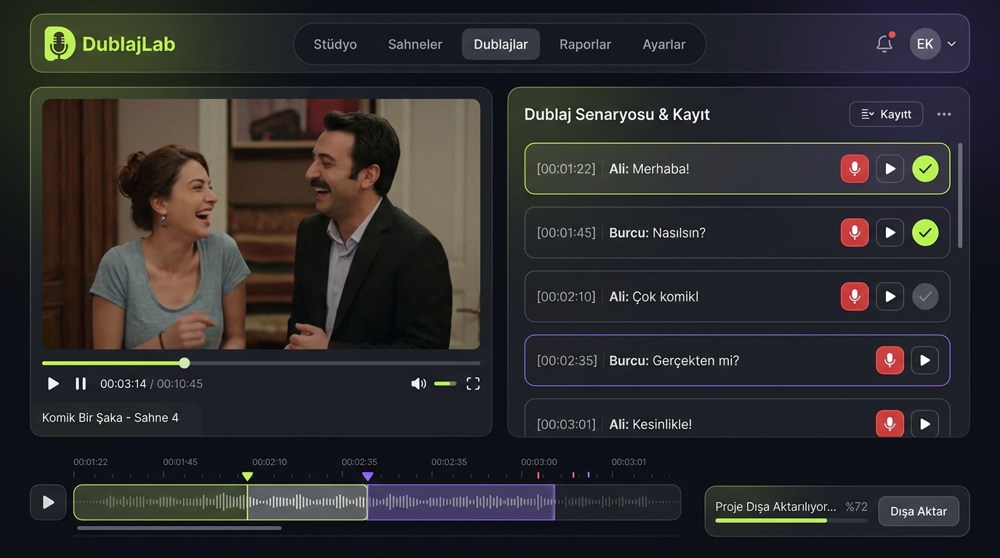
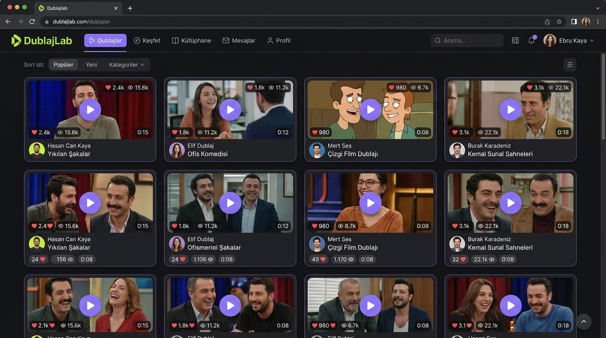

# 🧪 DublajLab — Kendi Sesinle Dublaj Yap

**Kendi sesinle yeniden dublajla.**

DublajLab, kısa sahneleri veya kendi videolarınızı kendi mikrofonunuzla seslendirmenizi sağlayan yaratıcı bir web platformudur. Tarayıcıda ses kaydedin, zaman çizelgesinde (timeline) düzenleyin ve saniyeler içinde altyazılı, mixlenmiş MP4 dosyanızı indirin.

> 🌐 **Live Demo (Public Beta):** [www.dublajlab.com.tr](https://www.dublajlab.com.tr/)

> Durum: Public Beta. Ürün temel özellikleriyle test edilebilir ve stabil durumdadır.
 Production aşamasında HTTPS kullanımı **zorunludur**. Mümkünse HttpOnly çerezlere (cookies) geçilmesi tavsiye edilir.

## Yönetim ve moderasyon

`ADMIN_EMAILS` içinde tanımlanan yöneticiler için kullanıcı/VIP yönetimi, içerik raporları,
yorum gizleme, sistem sağlık metrikleri ve admin işlem kayıtları bulunur. Yetki kontrolleri
yalnız arayüzde değil backend endpoint'lerinde de uygulanır. Yeni migration'lar container
başlarken `alembic upgrade head` ile uygulanır. Admin ekranları normal kullanıcılara açık değildir.

### Sonraki teknik geliştirmeler

- [ ] Dalga formu ve sürüklenebilir timeline
- [ ] Hazır, açık lisanslı demo video paketi
- [ ] Kayıt ses seviyesi ve gürültü azaltma kontrolleri
- [ ] Video trim ve dikey/yatay export presetleri
- [ ] Kalıcı job queue ve otomatik dosya temizliği

### Sonraki ürün — Müzik Pratik + Cover Studio

- [ ] Audio upload
- [ ] Tempo ve pitch değiştirme
- [ ] Vokal azaltma / instrumental denemesi
- [ ] Karaoke/cover export

Gelecekteki ürün özeti: “Şarkı dosyanı yükle; tempo/ton değiştir, vokal azalt, karaoke/pratik çıktısı al.”

### Sonraki ürün — Kısa Video Altyazı + Dublaj

- [ ] Speech-to-text
- [ ] Otomatik Türkçe altyazı
- [ ] Kısa AI dublaj
- [ ] Creator export presetleri

## LinkedIn / CV açıklaması

> Built a browser-based Turkish dubbing studio using FastAPI, React, TypeScript and FFmpeg. Implemented timeline-based microphone recording, per-line audio placement, subtitle burn-in, original-audio mixing and H.264 MP4 export, with an optional AI text-to-speech mode.

Önceki proje serisi için istenen CV maddesi de referans amacıyla korunmuştur:

> Built an AI-powered Turkish meme dubbing studio using FastAPI, React/Next.js, FFmpeg and text-to-speech APIs. Implemented video upload, Turkish voiceover generation, subtitle burn-in and MP4 export.

## Bilinen sınırlar

- Export istekleri arka plan job'ına alınır. Redis yapılandırılırsa job durumu Redis'te tutulur;
  Redis yoksa process belleği fallback'i kullanıldığı için restart sırasında durum kaybolabilir.
- BackgroundTasks tabanlı worker aynı uygulama sürecinde çalışır; yoğun production kullanımı için Celery/RQ, retry politikası ve concurrency limiti gerekir.
- Kaynak ve çıktı videoları uygulama içinde otomatik zamanlanmaz; TTL policy'li cleanup endpoint'i cron/zamanlanmış görevle çağrılmalıdır.
- Public demo export limiter Redis yapılandırılmadığında process belleğine düşer; bu fallback
  restart durumunda sıfırlanır ve çoklu worker/container arasında paylaşılmaz.
- Mikrofon formatı tarayıcıya göre WebM/Opus veya MP4/AAC olabilir; FFmpeg’in ilgili decoder ile derlenmiş olması gerekir.
- Bu geliştirme ortamında FFmpeg kurulu değilse gerçek medya smoke testi yapılamaz.
- Replik zamanları form alanlarıyla düzenlenir; görsel sürükle-bırak timeline henüz yoktur.
- Platform arayüzündeki Discord bağlantısı ve bazı kurumsal metinler beta/taslak durumundadır.
  VIP yetkisi backend tarafından uygulanır. Shopier checkout yalnız gerekli provider ayarları
  mevcutsa açılır; canlı ticari kullanımdan önce gerçek yasal metinler ve gerçek Shopier
  sandbox/callback doğrulaması tamamlanmalıdır.
